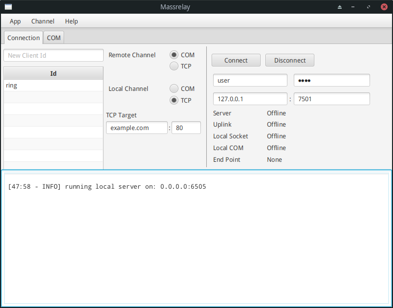

# MASSRELAY

Point to point connection without need for a static IP, even behind NAT (TCP socket *and* serial port support included).

There's a catch though: a man-in-the-middle server is needed, this is how Massrelay overcomes need for a static IP or
firewall rules to allow incoming connections.

## FEATURES

- SSL connection (not activated by default!, cert must be generated).
- TCP to Serial connection.
- TCP to TCP connection.
- Serial to TCP connection.
- Serial to Serial connection.
- Accounting (how much data is used).
- Permission management.
- Fare traffic shaping.

## HOW IT WORKS

There are 4 applications included in this project (named somewhat randomly!)

- Beryllium Nitrate: this is the man-in-the-middle server.
- Copper Carbonate: this is the client application you run on your laptop.
- Iron Fluoride: it will run on a remote machine and will publish a local Serial port through Beryllium Nitrate to
  Copper Carbonate.
- Iron Oxide: it will run on a remote machine and will publish a some arbitrary host / port (upon request) through
  Beryllium Nitrate to Copper Carbonate.

```
+--------------------+ +--------------------+ +--------------------+
|Copper Carbonate 00:| |Copper Carbonate 01:| |Copper Carbonate 02:|
|I want example.com  | |I want 127.0.0.1:22 | |I want /dev/ttyUSB01|
|using node00        | |using node01        | |using node02        |
+-----------+--------+ +------+-------------+ +---+----------------+
            |                 |                   |
            +--------------+  |  +----------------+
                           |  |  |
        +------------------v--v--v---------------+
        |    NAT, Firewall, Internet, Whatever   |
        +------------------+--+---+--------------+
                           |  |  |
        +------------------v--v--v---------------+
        |                                        |
        |             Beryllium Nitrate          |
        |                                        |
        +------------------^--^--^---------------+
                           |  |  |
        +------------------+--+--+---------------+
        |    NAT, Firewall, Internet, Whatever   |
        +------------------^--^--^---------------+
                           |  |  |
       +-------------------+  |  +-------------+
       |                      |                |
 +-----+----+       +--------+--+       +------+-------+
 |Iron Oxide|       | Iron Oxide|       | Iron Fluoride|
 |on Node 00|    +->| on Node 01|---+   | on Node 02   |--+
 +-----+----+    |  +-----------+   |   +----^---------+  |
       |         |                  |        |            |
       |         |  +------------+  |        |            |
       |         +--|127.0.0.1:22|<-+        |            |
       |            +------------+     +-----+---------+  |
       |                               | /dev/ttyUSB01 |<-+
 +-----v----------+                    +---------------+
 | example.com:80 |
 +----------------+
```

### REAL LIFE USE CASE

We used massrelay to remotely program PLC devices.

1. Our local application was a regular windows application that could only write to Serial ports, so Copper Carbonate
   was connected to it using a loop back serial cable.
2. Then a Raspberry Pi running Iron Fluoride, was connected to the PLC device, in another city 600 kilometers away.
3. Beryllium Nitrate, running on a VPS, connected these two.

We also used massrelay to ssh into the Raspberry Pi which was behind NAT and firewall (the firewall blocked all incoming
connections).

### HOW TO RUN

0. Configure `datasource` in [application.yml](./beryllium_nitrate/src/main/resources/application.yml) in Beryllium
   Nitrate (db name, user and password).
1. Run Beryllium Nitrate on a publicly accessible server, by default it uses ports 7504 and 7501. Take note of Beryllium
   Nitrate's ip address or assign a domain to it. Ports can be configured in
   [berylliumNitrate.json](./beryllium_nitrate/src/main/resources/berylliumNitrate.json)
2. Configure Iron Oxide on a remote machine, to connect to Beryllium Nitrates host, configure it in
   [ironOxide.json](./iron_oxide/src/main/resources/ironOxide.json).
3. Configure the username and password (like `user:pass`) in ironOxide.json.
4. Configure the host and username and password, same as step 2 and 3 but for Iron Fluoride (in
   [ironFluoride.json](./iron_fluoride/src/main/resources/ironFluoride.json)).
5. Use the [make_user.sh](./x_scripts/make_user.sh) **on Beryllium Nitrate host** to add the `user:pass` you just used
   in steps 3 and 4 to database.
6. Use the same script to create another user:pass for Copper Carbonate, again, *on Beryllium Nitrate* host.
7. Use the script [perm_permit.sh](./x_scripts/perm_permit.sh) on Beryllium Nitrate host to allow access to the created
   Iron Oxide client to Copper Carbonate client.
8. Launch Copper Carbonate on your local machine.
9. On the right boxes in the UI, enter the user:pass you created in step 6.
10. enter Beryllium Nitrate host and port on the right boxes in the UI.
11. On left, select you want to connect to Serial port or TCP endpoint, and if TCP, choose which host and port you want
    to connect to.
12. Select how you want to locally use Copper Carbonate, over COM port (if yes, configure the port on the second tab) or
    through TCP connection. If using TCP connection, it is 0.0.0.0:6505 by default.
13. On left enter the name of client (the username in step 5) and press enter. From the bottom list select it.
14. Click connect. Wait until `Server` and `Uplink` becomes online.
15. Through whatever application you like, connect to the selected COM port or 0.0.0.0:6505.
16. Have fun.

I know these are a lot of steps but many of them are needed only once, such as creating users.

### SOME LIBRARIES USED

- Netty, the beast underlying massrelay.
- Spring Boot, for DI mostly.
- fazecast's jserialcomm for serial port.
- Konfigurations (https://github.com/hkoosha/konfigurations)
- JavaFx, unfortunately.
- Web UI for Beryllium Nitrate

### ROADMAP

It's nice to:

- Migrate to using swing instead of JavaFx.
- Audit for proper security! use ssl by default, and use it properly!
- Nodes are currently in single-user mode. If one connects to them no one else can use them.
- Have a TUI too instead of just GUI.

### SCREENSHOT OF COPPER CARBONATE

